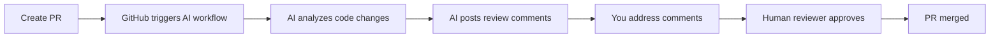

# 🤖 AI PR Review Setup Guide

> Automated AI code review for your pull requests. Get instant feedback on quality, security, performance, and best practices.

---

## 📖 Table of Contents

- [What Is This?](#-what-is-this)
- [Why Are We Doing This?](#-why-are-we-doing-this)
- [Who Needs To Do This?](#-who-needs-to-do-this)
- [Video Tutorials](#-video-tutorials)
- [Setup Instructions](#-setup-instructions)
- [How It Works](#-how-it-works)
- [Maintenance](#-maintenance)

---

## 🎯 What Is This?

This guide explains how to set up automated AI code review for your pull requests. The AI reviewer will analyze your code changes and provide feedback on quality, security, performance, and best practices.

---

## 💡 Why Are We Doing This?

- 🐛 **Catch bugs and security issues early**
- 📏 **Maintain consistent code quality** across all projects
- ⚡ **Get instant feedback** before human review
- 📚 **Learn best practices** through AI suggestions
- 🚀 **Speed up the review process**

---

## 👤 Who Needs To Do This?

**Every developer** working on projects that use GitHub pull requests.

---

## 📹 Video Tutorials

> **Watch these videos first** to see the complete setup process!

| Video | Link | What You'll Learn |
|-------|------|-------------------|
| **Complete Setup Walkthrough** | [Watch on Loom](https://www.loom.com/share/7a83d47bfc4a4499abb2b5e49292edca) | Creating project.md & workflow file |
| **AI Review in Action** | [Watch on Loom](https://www.loom.com/share/96b5921a6fda4343ab37f6e9f983f3e0) | How AI review works on actual PRs |

These videos demonstrate:
- ✅ Creating the project.md file
- ✅ Adding the workflow file
- ✅ How AI review works on actual PRs
- ✅ Addressing AI feedback

---

## 🛠️ Setup Instructions

### Two Required Steps

There are only **2 files** you need to create:

```
✓ docs/project.md
✓ .github/workflows/pr-review.yml
```

---

### Step 1️⃣: Create Project Documentation File

**Location:** `docs/project.md`

This file helps the AI understand your project structure and coding standards.

#### What to Include

1. **Project overview** (what does this project do?)
2. **Directory structure** (where things are located)
3. **Tech stack** (React, Node.js, TypeScript, etc.)
4. **Coding conventions** (naming patterns, file organization)
5. **Important areas** (security-sensitive code, critical business logic)

#### Example Structure

```markdown
# Project Name

## Overview
Brief description of what this project does.

## Directory Structure
```
src/
├── components/    # UI components
├── services/      # API calls and business logic
├── utils/         # Helper functions
└── types/         # TypeScript types
```

## Tech Stack
- Frontend: React with TypeScript
- Styling: Tailwind CSS
- State: Redux
- Testing: Jest

## Coding Standards
- Components: PascalCase (UserProfile.tsx)
- Functions: camelCase (fetchUserData)
- Constants: UPPER_SNAKE_CASE (API_URL)

## Important Notes
- Authentication logic is in src/services/auth.ts
- Payment processing in src/services/payment.ts
```

#### How to Create

```bash
mkdir -p docs
touch docs/project.md
# Then edit the file with your project information using any AI tool you are using
```

---

### Step 2️⃣: Add GitHub Workflow File

**Location:** `.github/workflows/pr-review.yml`

This file triggers the AI review automatically when you create or update a PR.

#### Copy This Content EXACTLY

```yaml
name: AI PR Review

on:
  pull_request:
    types: [opened, synchronize, reopened]

jobs:
  review:
    uses: sprintx-official/.github/.github/workflows/pr-review.yml@main
    secrets: inherit
```

#### How to Create

```bash
mkdir -p .github/workflows
touch .github/workflows/pr-review.yml
# Then paste the content above
```

---

### 📦 Commit Your Changes

After creating both files:

```bash
git add docs/project.md .github/workflows/pr-review.yml
git commit -m "chore: add AI PR review setup"
git push
```

---

## ⚙️ How It Works



### The Process

1. **You create a pull request**
2. **GitHub automatically triggers** the AI review workflow
3. **AI analyzes your code** changes against:
   - Best practices
   - Security vulnerabilities
   - Performance issues
   - Your project standards (from project.md)
4. **AI posts review comments** on your PR
5. **You address the comments** and update your code
6. **Human reviewer approves**
7. **PR gets merged**

---

## 📅 When Does AI Review Run?

- ✅ When you open a new PR
- ✅ When you push new commits to an existing PR
- ✅ When you reopen a closed PR

---

## 🔍 What Does AI Check?

| Category | Details |
|----------|---------|
| ✅ **Code Quality** | Best practices and clean code patterns |
| 🔒 **Security** | Vulnerabilities and security risks |
| ⚡ **Performance** | Performance issues and optimizations |
| 📘 **Type Safety** | TypeScript type correctness |
| 🐛 **Bugs** | Potential bugs and edge cases |
| 🏗️ **Structure** | Adherence to your project structure |
| 📏 **Standards** | Coding standards compliance |

---

## 🔧 Maintenance

### Keep project.md Updated When:

- 🔄 Project structure changes
- 📦 New dependencies added
- 📋 Coding standards evolve
- 👥 New team members join

> **Recommended:** Review and update monthly

---

## 📝 Document Info

| | |
|---|---|
| **Version** | 1.0.0 |
| **Last Updated** | February 2026 |

---

<div align="center">

**Need help?** Check the video tutorials above or contact your team lead.

</div>
